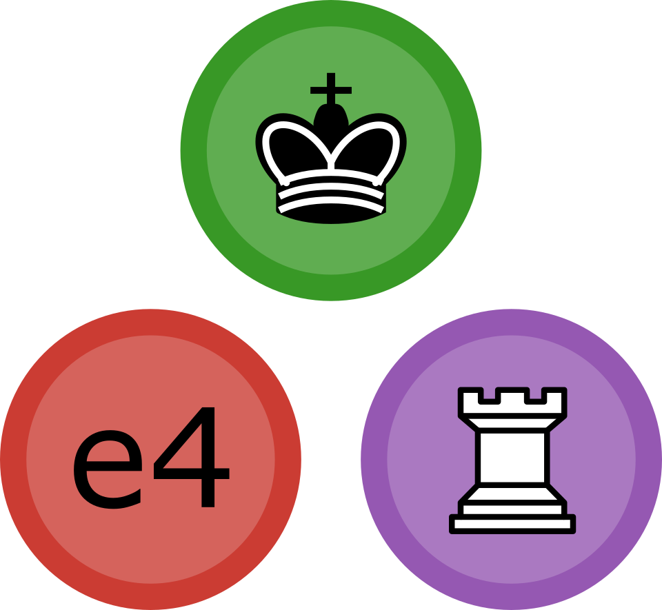

<a name="logo"/>

</img>
</a>

<a name="Chess-Engine-in-Julia"/>

# Chess.jl

Julia module that plays chess, and [chess960](https://en.wikipedia.org/wiki/Chess960).   To run this program, you must install [Julia](http://julialang.org/), run it from the github cloned directory, and do `include("Chess.jl")` to run the game loop.   The chess board and move history is printed in the [REPL](https://en.wikipedia.org/wiki/Read%E2%80%93eval%E2%80%93print_loop).

The goal is to create a reasonably performant chess engine, that can generate legal moves, and play with minimal interface (i.e. in the REPL).   

Bitboards are used to represent the state.   This code is a learning exercise for me in both engine building, and performant Julia code.

## Resources
* [Chess programming wiki](https://chessprogramming.wikispaces.com/)
* Open source code: [Stockfish - excellent](https://github.com/official-stockfish/Stockfish), [Ethereal](https://github.com/AndyGrant/Ethereal)
* [Book - How Computers Play Chess (1991) - David Levy](https://www.amazon.com/Computers-Play-Chess-David-Levy/dp/4871878015/ref=sr_1_1?ie=UTF8&qid=1476596099&sr=8-1&keywords=david+levy+how+computers)
* [Book - Computer Chess Compendium (2009) - David Levy](https://www.amazon.com/Computer-Chess-Compendium-David-N-L/dp/487187804X/ref=sr_1_7?ie=UTF8&qid=1476457271&sr=8-7&keywords=computer+chess)
* [TSCP Chess] (https://sites.google.com/site/tscpchess/move-generation)
* Gamedev chess articles: [1. Intro](http://www.gamedev.net/page/resources/_/technical/artificial-intelligence/chess-programming-part-i-getting-started-r1014), [2. Data structures](http://www.gamedev.net/page/resources/_/technical/artificial-intelligence/chess-programming-part-ii-data-structures-r1046), [3. Move gen](http://www.gamedev.net/page/resources/_/technical/artificial-intelligence/chess-programming-part-iii-move-generation-r1126), [4. Eval functions](http://www.gamedev.net/page/resources/_/technical/artificial-intelligence/chess-programming-part-vi-evaluation-functions-r1208)
* [Chess Engine Communication Protocol](http://www.tim-mann.org/engines.html)
* [Computer chess programming theory](http://www.frayn.net/beowulf/theory.html)
* [Chess Tree Search](https://verhelst.home.xs4all.nl/chess/search.html)
* [Bruce Moreland - Chess programming topics](https://web.archive.org/web/20071026090003/http://www.brucemo.com/compchess/programming/index.htm)

## History

