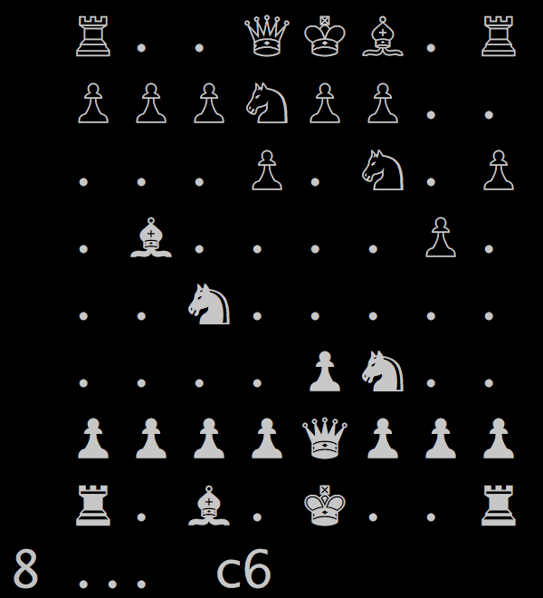

# Chess.jl

Julia module that plays chess, and [chess960](https://en.wikipedia.org/wiki/Chess960).

The goal is to create a reasonably performant chess engine, that can generate legal moves, and play with minimal interface (i.e. in the REPL).   

Bitboards are used to represent the state.   This code is a learning exercise for me in both engine building, and performant Julia code.

## Resources

[Chess programming](https://chessprogramming.wikispaces.com/)

[Stockfish code](https://github.com/official-stockfish/Stockfish)

## History
### 2016 October 7
I've gotten piece movement working and displaying.  Still to do are en passant, promotion, and testing for illegal moves that put the king in check.

### 2016 October 15
The bitboard nearly works, castling and en passant have been added.  I found a nasty bug to do with << with a negative number.  It tested fine initially, but caused unpredictable behavior in v0.46 and v0.50, with different random numbers selected (from the same seed), and corruption of memory structures!   The test perft() reports incorrect numbers of moves by ply=4 because of this.  This version of the code generates moves at about 400kNodes/sec, which isn't bad, but could be faster for a 64-bit laptop.  

The UI in the REPL looks a little nicer, and can allow the user to select a move from the list.

Next to implement is pinned pieces and not allowing king moves into check.  I want generate_moves() to only make legal suggestions.
