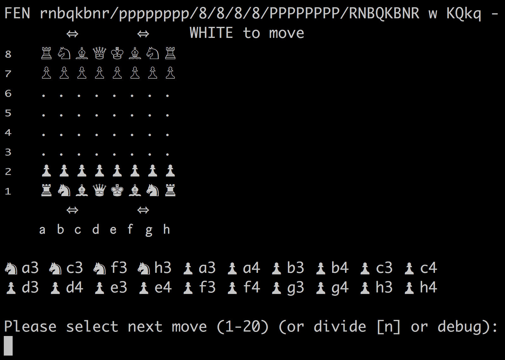

# Chess.jl

Julia module that plays chess, and [chess960](https://en.wikipedia.org/wiki/Chess960).   To run this program, you must install [Julia](http://julialang.org/), run it from the github cloned directory, and do `include("Chess.jl")` to run the game loop.   The chess board and move history is printed in the [REPL](https://en.wikipedia.org/wiki/Read%E2%80%93eval%E2%80%93print_loop).

The goal is to create a reasonably performant chess engine, that can generate legal moves, and play with minimal interface (i.e. in the REPL).   

Bitboards are used to represent the state.   This code is a learning exercise for me in both engine building, and performant Julia code.

## Resources
* [Chess programming wiki](https://chessprogramming.wikispaces.com/)
* Open source code: [Stockfish - excellent](https://github.com/official-stockfish/Stockfish), [Ethereal](https://github.com/AndyGrant/Ethereal)
* [Book - How Computers Play Chess (1991) - David Levy](https://www.amazon.com/Computers-Play-Chess-David-Levy/dp/4871878015/ref=sr_1_1?ie=UTF8&qid=1476596099&sr=8-1&keywords=david+levy+how+computers)
* [Book - Computer Chess Compendium (2009) - David Levy](https://www.amazon.com/Computer-Chess-Compendium-David-N-L/dp/487187804X/ref=sr_1_7?ie=UTF8&qid=1476457271&sr=8-7&keywords=computer+chess)
* [TSCP Chess] (https://sites.google.com/site/tscpchess/move-generation)
* Gamedev chess articles: [1. Intro](http://www.gamedev.net/page/resources/_/technical/artificial-intelligence/chess-programming-part-i-getting-started-r1014), [2. Data structures](http://www.gamedev.net/page/resources/_/technical/artificial-intelligence/chess-programming-part-ii-data-structures-r1046), [3. Move gen](http://www.gamedev.net/page/resources/_/technical/artificial-intelligence/chess-programming-part-iii-move-generation-r1126), [4. Eval functions](http://www.gamedev.net/page/resources/_/technical/artificial-intelligence/chess-programming-part-vi-evaluation-functions-r1208)
* [Chess Engine Communication Protocol](http://www.tim-mann.org/engines.html)
* [Computer chess programming theory](http://www.frayn.net/beowulf/theory.html)
* [Chess Tree Search](https://verhelst.home.xs4all.nl/chess/search.html)

## History
### 2016 October 7
I've gotten piece movement working and displaying.  Still to do are en passant, promotion, and testing for illegal moves that put the king in check.

### 2016 October 15
The bitboard nearly works, castling and en passant have been added.  I found a nasty bug to do with << with a negative number.  It tested fine initially, but caused unpredictable behavior in v0.46 and v0.50, with different random numbers selected (from the same seed), and corruption of memory structures!   The test perft() reports incorrect numbers of moves by ply=4 because of this.  This version of the code generates moves at about 400kNodes/sec, which isn't bad, but could be faster for a 64-bit laptop.  

The UI in the REPL looks a little nicer, and can allow the user to select a move from the list.

Next to implement is pinned pieces and not allowing king moves into check.  I want generate_moves() to only make legal suggestions.

### 2016 October 22 - v0.10
The legal move generator is working now, and being tested against a handful of different known perft starting positions.  [FEN](https://en.wikipedia.org/wiki/Forsyth%E2%80%93Edwards_Notation) input and output is now supported, which helps in debugging against other engines.   All the perft results are correct up to level four now!  Past that the engine takes a long time to run, so these still have to be evaluated.   The kNodes/sec has dropped by an order of magnitude (the engine is much slower, due to checking for legal moves (pinned pieces, etc.)).   

The UI in the REPL looks even nicer, and now allows the developer to print debug or "divide" output.

Now I'm actually ready to either set up computer play with an evaluation tree, or optimize.   Some important steps are probably to create an "unmove" and improve speed of perft().
