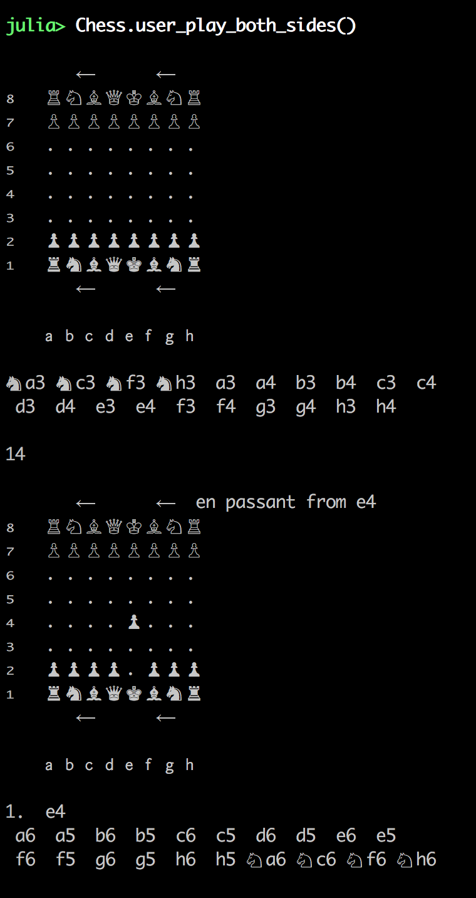
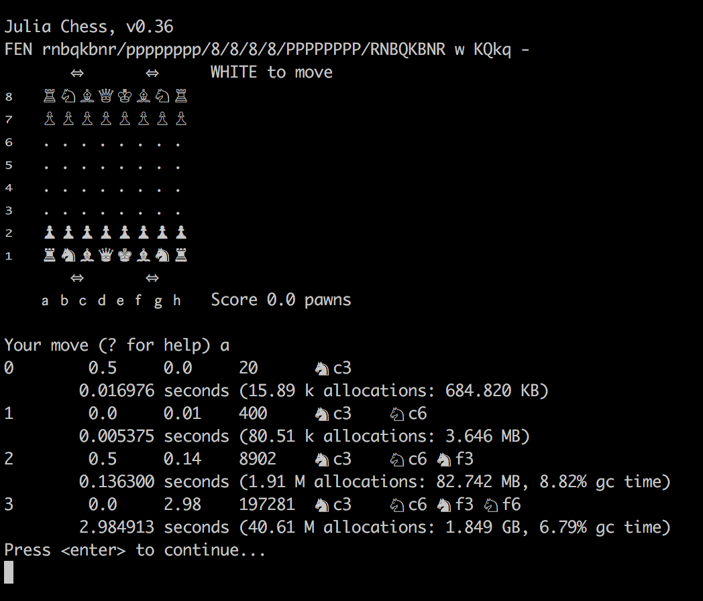

## History

### 2016 October 7
I've gotten piece movement working and displaying.  Still to do are en passant, promotion, and testing for illegal moves that put the king in check.

### 2016 October 15
The bitboard nearly works, castling and en passant have been added.  I found a nasty bug to do with << with a negative number.  It tested fine initially, but caused unpredictable behavior in v0.46 and v0.50, with different random numbers selected (from the same seed), and corruption of memory structures!   The test perft() reports incorrect numbers of moves by ply=4 because of this.  This version of the code generates moves at about 400kNodes/sec, which isn't bad, but could be faster for a 64-bit laptop.

The UI in the REPL looks a little nicer, and can allow the user to select a move from the list.

Next to implement is pinned pieces and not allowing king moves into check.  I want generate_moves() to only make legal suggestions.

### 2016 October 22 - v0.10
The legal move generator is working now, and being tested against a handful of different known perft starting positions.  [FEN](https://en.wikipedia.org/wiki/Forsyth%E2%80%93Edwards_Notation) input and output is now supported, which helps in debugging against other engines.   All the perft results are correct up to level four now!  Past that the engine takes a long time to run, so these still have to be evaluated.   The kNodes/sec has dropped by an order of magnitude (the engine is much slower, due to checking for legal moves (pinned pieces, etc.)).

The UI in the REPL looks even nicer, and now allows the developer to print debug or "divide" output.

Now I'm actually ready to either set up computer play with an evaluation tree, or optimize.   Some important steps are probably to create an "unmove" and improve speed of perft().

### 2016 October 29 - v0.28
I've created a more full featured REPL game loop, allowing undo, analysis, etc.
I've also started running some games from the xboard UI, with a couple of bugs still to fix.

Additionally, the negamax search is now being used to search the whole tree to requested depth, and is returning score, number of nodes visited, time, and principal variation.

### 2016 November 3 - v0.28
Added undo_move which reduces memory churn and speeds up thinking.

